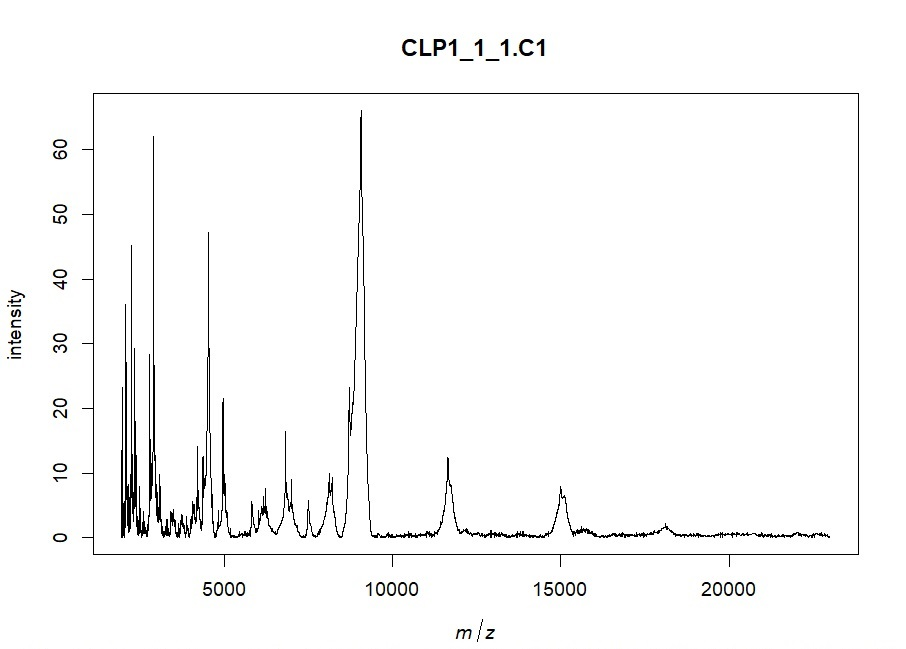

<h1 align="center"> Análisis de muestras de MALDI-TOF de ratones.  </h1>
<h1 align="center"> Para: Lautaro Maceira, Bárbara Rearte  </h1>

   
   

## Índice

*[Descripción del proyecto](#descripción-del-proyecto)

*[Características de las muestras](#características-de-las-muestras)

*[Características y nomenclatura de  los archivos](#nomenclatura-de-los-archivos)

*[Pre-procesamiento](#pre-procesamiento)

*[Algoritmos no supervisados](#algoritmos-no-supervisados)

*[Algoritmos supervisados](#algoritmos-supervisados)

*[Conclusión](#conclusión)

## Descripción del proyecto

El proyecto consiste en el procesamiento y análisis de espectros MALDI-TOF obtenidos a partir de plasma de ratones a los que se le ha realizado una ligadura y punción cecal (CLP) como modelo de sepsis, y ratones impostores (SHAM). El procesamiento consiste en el filtrado, acondicionamiento y transformación de los espectros. El análisis consiste en la utilización de algoritmos de aprendizaje maquinal que permitan detectar características distintivas de estos espectros y clasificar tanto las muestras de CLP como sus diferentes estadíos dentro del modelo de la patología.

## Características de las muestras

* Tipo de muestras: CLP y SHAM
* Días de adquisición: 1, 2, 4 y 7
* Cantidad de muestras iniciales: 303
* Metodología de adquisición: Cada muestra es sub-dividida en "réplicas biológicas" que son depositadas cada una en un pozo o "well" del equipo. Cada una de estas wells puede ser adquirida o leída mas de una vez, obteniéndose así "réplicas técnicas". La cantidad de réplicas biológicas y técnicas por muestra es variable, llegando a un máximo de 3 de cada una. Es decir, en el caso mas extremo, una muestra podría ser replicada tres veces biológicamente, y cada una adquirida otras tres veces, llegando así a un número de nueve adquisiciones correspondientes a una misma muestra.

## Características y nomenclatura de  los archivos

Los lenguajes utilizados para el procesamiento y el análisis de los espectros fueron pyhton y R. Los archivos están enumerados por orden de procesamiento. A excepción del primer archivo de pre-procesamiento, los archivos están nomenclados de la siguiente manera:

x_alg_muestras_dias

Donde

* x: numeración
* alg: algoritmos utilizados, supervisados (s) o no supervisados (ns)
* muestras: cantidad de muestras, indicando si se usan las réplicas biológicas (m122) o las muestras ya promediadas (m51)
* dias: días utilizados para el análisis, todos (d1247) o solo días 2 y 4 (d24)

## Pre-procesamiento

### Archivo: 1_preprocesamiento.R

El pre-procesamiento está compuesto por las siguientes etapas:
* Carga de los espectros y su metadata correspondiente

  

  <em>Figura 1: Espectro cargado sin transformar</em>

* Control de calidad de los espectros mediante el uso de un estimador robusto Q. A fines prácticos, este control de calidad filtra espectros ruidosos o con el espectro "planchado" debido al fenómeno de supresión iónica en la etapa de adquisición.

* Transformación de los espectros. Transformación de intensidad mediante la función raíz cuadrada (sqrt), suavizado del espectro mediante la función "wavelet", detección y remoción de la linea de base y alineamiento de los espectros, en ese orden.

  <em>Figura 2: Detección de la linea de base</em>

  <em>Figura 3: Espectro con la línea de base removida</em>

* Se realiza un promediado de las réplicas técnicas y biológicas.
* Extracción de picos preponderantes de cada espectro. Esto se logra definiendo un umbral a partir del cual se comienzan a detectar los picos. Este umbral se define a partir de dos veces la relación señal a ruido del espectro (SNR).
* A partir de la detección de los picos en cada espectro, se crea la matriz de intensidad, las cual contiene en sus filas las muestras y en las columnas los picos detectados. Esta matriz también es sujeta a transformaciones para preservar los picos con mayor frecuencia de aparición en los espectros y eliminar los picos "extraños", ya que lo que buscamos en esta instancia es que las variables (en este caso los picos) aporten información al sistema para su posterior análisis. Se crea también la matriz dicotómica, la cual se origina a partir de la definición de un umbral en la matriz de intensidades que transforma los valores de los picos en 1 y 0 segun la presencia o ausencia de cada pico en cada muestra.
* Por último, guardar las matrices y los metadatos. Se obtienen matrices de intensidades y dicotómicas tanto para las muestras individuales (matriz de 51 filas x 218 columnas) como para las réplicas biológicas (matriz de 122 filas x 218 columnas)

## Algoritmos No Supervisados

## Algoritmos Supervisados

## Conclusión
