<h1 align="center"> Análisis de muestras de MALDI-TOF de ratones.  </h1>
<h3 align="center"> Origen de las muestras: Instituto Malbrán </h3>
<h3 align="center"> Responsables: Lautaro Maceira, Bárbara Rearte  </h3>

   
   

## Índice

*[Descripción del proyecto](#descripción-del-proyecto)

*[Características de las muestras](#características-de-las-muestras)

*[Características y nomenclatura de los archivos](#características-y-nomenclatura-de-los-archivos)

*[Pre-procesamiento](#pre-procesamiento)

*[Seguimiento de cantidad de muestras](#seguimiento-de-cantidad-de-muestras)

*[Algoritmos no supervisados](#algoritmos-no-supervisados)

*[Algoritmos supervisados](#algoritmos-supervisados)

*[Conclusión](#conclusión)

## Descripción del proyecto

  
Haz clic para expandir

El proyecto consiste en el procesamiento y análisis de espectros MALDI-TOF obtenidos a partir de plasma de ratones a los que se le ha realizado una ligadura y punción cecal (CLP) como modelo de sepsis, y ratones impostores (SHAM). El procesamiento consiste en el filtrado, acondicionamiento y transformación de los espectros. El análisis consiste en la utilización de algoritmos de aprendizaje maquinal que permitan detectar características distintivas de estos espectros y clasificar tanto las muestras de CLP como sus diferentes estadíos dentro del modelo de la patología.

## Características de las muestras

  
Haz clic para expandir

* Tipo de muestras: CLP y SHAM
* Días de adquisición: 1, 2, 4 y 7
* Cantidad de muestras iniciales: 303

* Metodología de adquisición: Cada muestra es sub-dividida en "réplicas biológicas" que son depositadas cada una en un pozo o "well" del equipo. Cada una de estas wells puede ser adquirida o leída mas de una vez, obteniéndose así "réplicas técnicas". La cantidad de réplicas biológicas y técnicas por muestra es variable, llegando a un máximo de 3 de cada una. Es decir, en el caso mas extremo, una muestra podría ser replicada tres veces biológicamente, y cada una adquirida otras tres veces, llegando así a un número de nueve adquisiciones correspondientes a una misma muestra.

## Características y nomenclatura de los archivos

  
Haz clic para expandir

Los lenguajes utilizados para el procesamiento y el análisis de los espectros fueron pyhton y R. Los archivos están enumerados por orden de procesamiento. A excepción del primer archivo de pre-procesamiento, los archivos están nomenclados de la siguiente manera:

*x_alg_muestras_dias*

Donde

* _x: numeración_
* _alg: algoritmos utilizados, supervisados (s) o no supervisados (ns)_
* _muestras: cantidad de muestras, indicando si se usan las réplicas biológicas (m122) o las muestras ya promediadas (m51)_
* _dias: días utilizados para el análisis, todos (d1247) o solo días 2 y 4 (d24)_

## Pre-procesamiento

  
Haz clic para expandir

### Archivo: 1_preprocesamiento.R

El pre-procesamiento está compuesto por las siguientes etapas:

* Carga de los espectros y su metadata correspondiente

  

     
   

   

     <em>Figura 1: Espectro cargado sin transformar</em>
   

* 
 Control de calidad de los espectros mediante el uso de un estimador robusto Q. A fines prácticos, este control de calidad filtra espectros ruidosos o con el espectro "planchado" debido al fenómeno de supresión iónica en la etapa de adquisición. 

* 
 Transformación de los espectros. Transformación de intensidad mediante la función raíz cuadrada (sqrt), suavizado del espectro mediante la función "wavelet", detección y remoción de la linea de base y alineamiento de los espectros, en ese orden. 

   

   
   

   

     <em>Figura 2: Detección de la linea de base</em>
   

   
   

   
   

   

     <em>Figura 3: Espectro con la línea de base removida</em>
   

* Se realiza un promediado de las réplicas técnicas y biológicas.

* 
Extracción de picos preponderantes de cada espectro. Esto se logra definiendo un umbral a partir del cual se comienzan a detectar los picos. Este umbral se define a partir de dos veces la relación señal a ruido del espectro (SNR).

   

   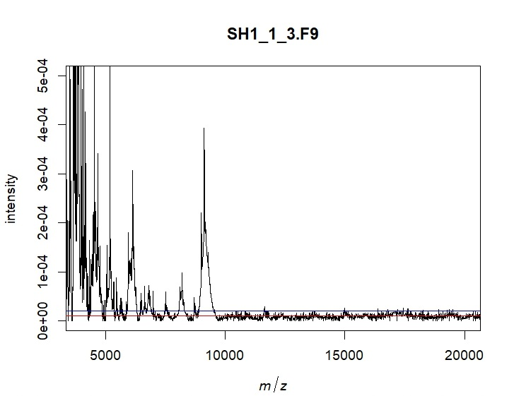
   

   

     <em>Figura 4: Espectro con la detección del nivel de ruido (en rojo) y la definición del umbral (en azul)</em>
   

   

   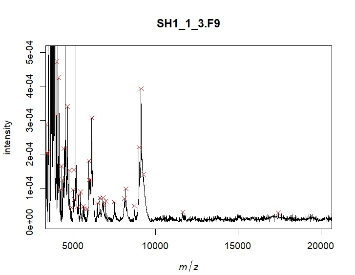
   

   

     <em>Figura 5: Detección de picos por encima del umbral establecido</em>
   

* 
A partir de la detección de los picos en cada espectro, se crea la matriz de intensidad, las cual contiene en sus filas las muestras y en las columnas los picos detectados. Esta matriz también es sujeta a transformaciones para preservar los picos con mayor frecuencia de aparición en los espectros y eliminar los picos "extraños", ya que lo que buscamos en esta instancia es que las variables (en este caso los picos) aporten información al sistema para su posterior análisis. Se crea también la matriz dicotómica, la cual se origina a partir de la definición de un umbral en la matriz de intensidades que transforma los valores de los picos en 1 y 0 segun la presencia o ausencia de cada pico en cada muestra.

   

   
   

   

     <em>Figura 6: Representación gráfica de la matriz de intensidades dicotómica. Las filas corresponden a las muestras y las columnas a los picos. El color celeste indica presencia del pico en esa muestra</em>
   

   
* 
Por último, guardar las matrices y los metadatos. Se obtienen matrices de intensidades y dicotómicas tanto para las muestras individuales (matriz de 51 filas x 218 columnas) como para las réplicas biológicas (matriz de 122 filas x 218 columnas)

## Seguimiento de cantidad de muestras

  
Haz clic para expandir

   
* Muestras iniciales o réplicas técnicas: 303
* Réplicas técnicas luego de control de calidad: 297
   * Réplicas biológicas: 122
   * Réplicas biológicas de días 2 y 4: 107
      * Muestras biológicas independientes: 55
      * Muestras biológicas independientes de días 2 y 4: 43

## Algoritmos No Supervisados

  
Haz clic para expandir

El procedimiento para la realización de los algoritmos No Supervisados fue el siguiente:
   1) Elección de conjunto de muestras (Réplicas biológicas o muestras independientes)
   2) Elección de los tiempos de muestreo (Todos los días o solo los días 2 y 4)
   3) Por medio de la matriz dicotómica, se aplica la función *bindaranking* con la cual se obtienen los picos que mejor variabilidad aportan a partir de un factor que se ingresa como variable de entrada. Este factor puede ser CLP vs SHAM, o días por ejemplo.
   4) Se realizan simulaciones de los modelos variando la cantidad de X primeros picos del análisis realizado en (3) y los algoritmos de clustering. Se realizaron pruebas con kmeans, HKmeans y PAM.
   5) Una vez realizada la clasificación No Supervisada, se comparan los puntos clasificados con su etiqueta de interés real (CLP, SHAM).
   6) Se calculan métricas de interés para evaluar el desempeño de los análisis

Resultados:

   ### Archivo: 2_ns_m122_d1247

   

   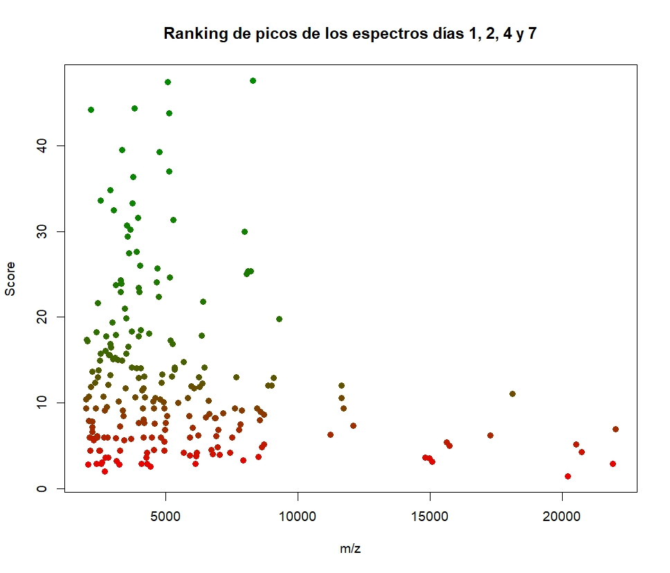
   

   

     <em>Figura 7: Picos mas preponderantes seleccionados por el algoritmo bindaranking a partir del factor CLP vs SHAM</em>
   

   

   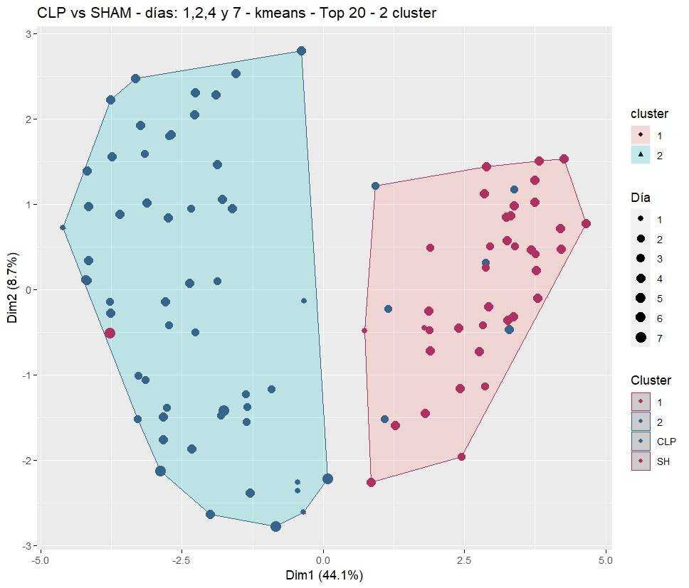
   

   

     <em>Figura 8: Clustering - CLP vs SHAM - Días 1, 2, 4 y 7 - TOP 20 picos - Algoritmo: kmeans</em>
   

   

   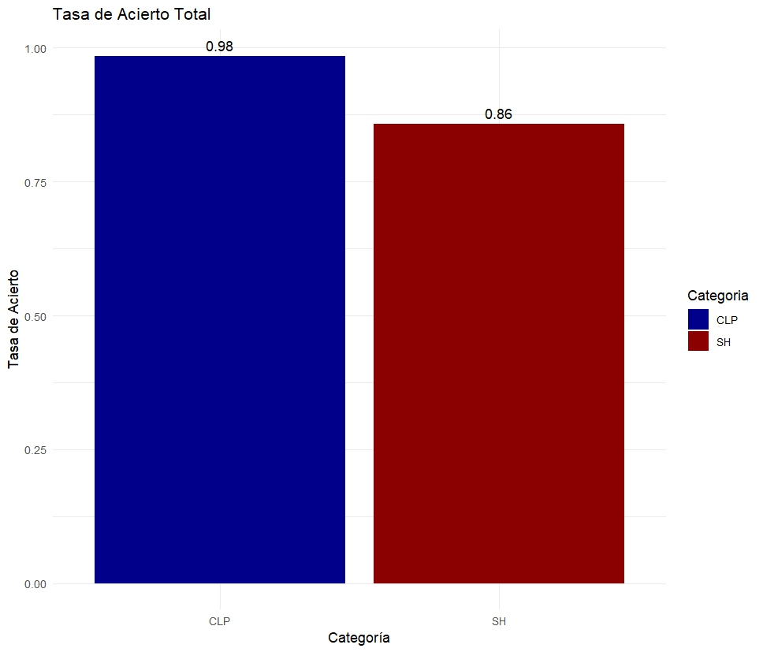
   

   

     <em>Figura 9: Tasa de acierto total</em>
   

   

   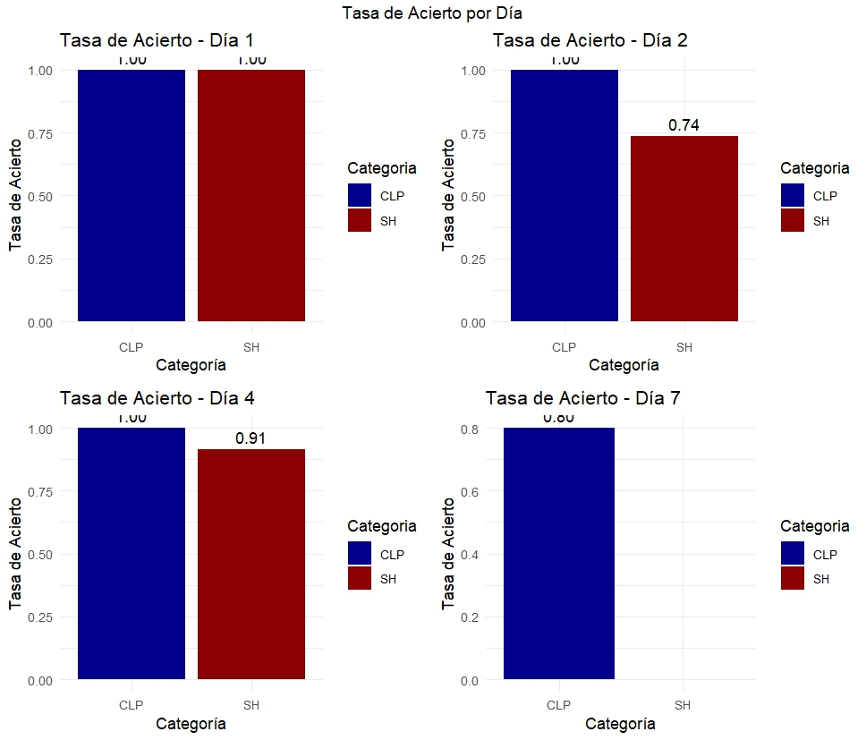
   

   

     <em>Figura 10: Tasa de acierto por día</em>
   

   Métricas:

   | Cluster | Tamaño | Ancho promedio silueta  |
   |---------|--------|-------------------------|
   | 1       | 56     | 0.38                    |
   | 2       | 66     | 0.30                    |

   | Métrica | Valor |
   |---------|-------|
   | VSP     | 0.34  |
   | WCSS    | 343   |
   | BCSS    | 216   |
   
   

   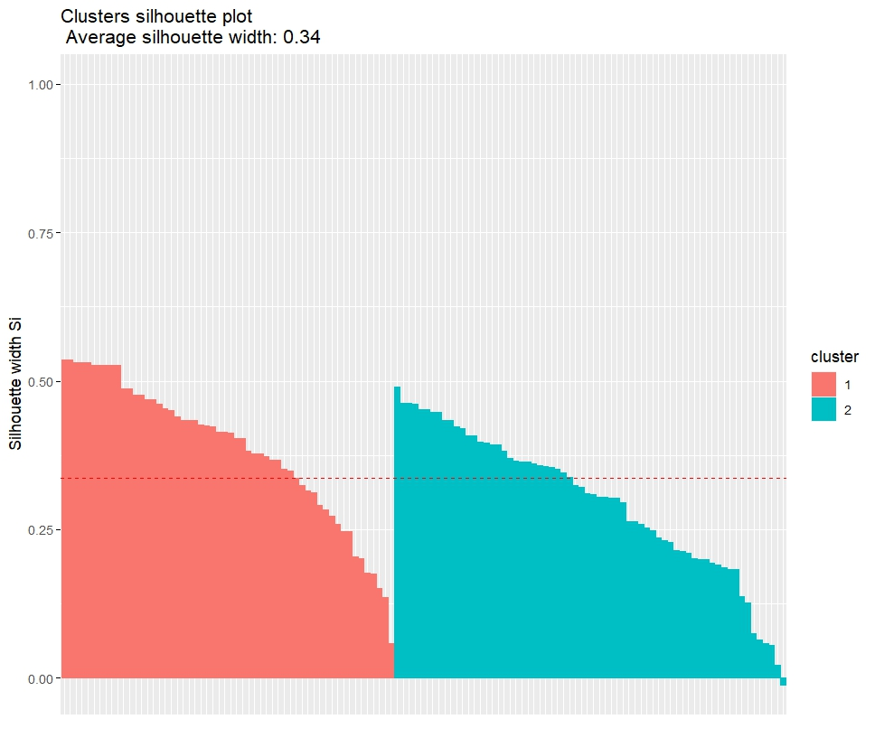
   

   

     <em>Figura 10: Gráfica de valores silhouette para cada punto y el promedio general</em>
   

   Matriz de confusión y métricas:
   
                
   | Referencia | cluster1 | cluster2 |
   |------------|----------|----------|
   | SHAM       | 48       | 1        |
   | CLP        | 8        | 65       |

   | Métrica    | Valor |
   |------------|-------|
   | Precision: | 0.98  |
   | Recall:    | 0.89  |
   | F1-Score:  | 0.93  |
   | Accuracy:  | 0.93  |

   
   ### Archivo: 4_ns_m122_d24

   

   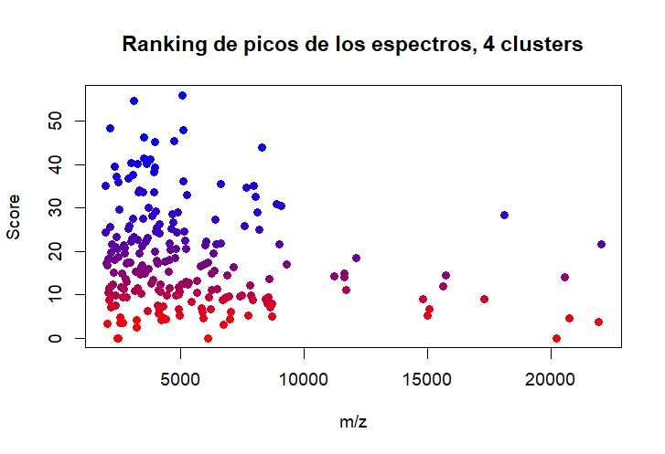
   

   

     <em>Figura 11: Picos mas preponderantes seleccionados por el algoritmo bindaranking a partir del factor CLP_D2 vs CLP_D4 vs SHAM_D4 vs SHAM_D2</em>
   

   *Clustering - CLP vs SHAM - Días 2 y 4 - TOP 30 picos - Algoritmo: Hkmeans*
   
   

   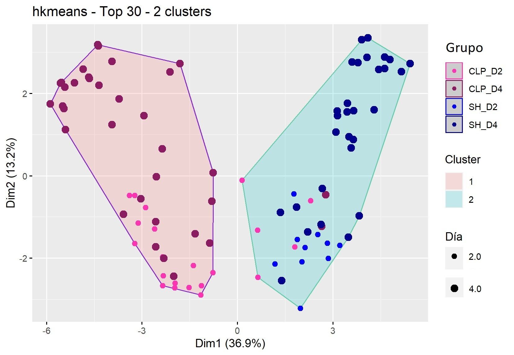
   

   

     <em>Figura 12: Clustering - CLP vs SHAM - Días 2 y 4 - TOP 30 picos - Algoritmo: Hkmeans</em>
   

   

   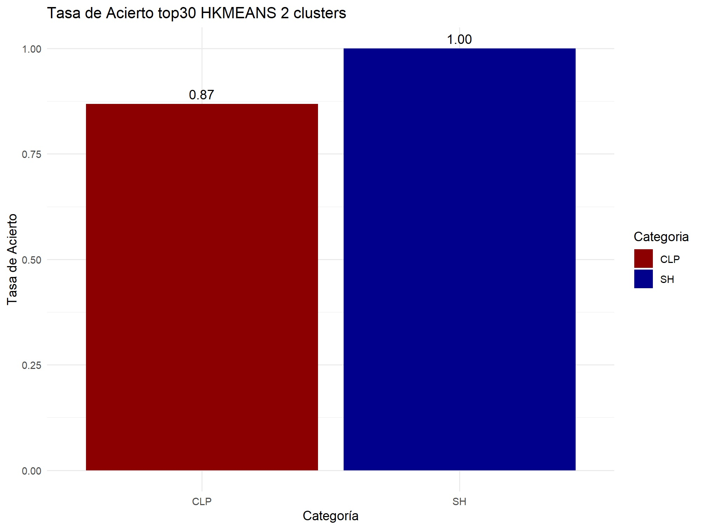
   

   

     <em>Figura 12: Tasa de acierto por día</em>
   

   Matriz de confusión y métricas:
   
   | Referencia | cluster1 | cluster2 |
   |------------|----------|----------|
   | SHAM       | 46       | 0        |
   | CLP        | 8        | 53       |

   | Métrica    | Valor |
   |------------|-------|
   | Precision: | 1.00  |
   | Recall:    | 0.87  |
   | F1-Score:  | 0.93  |
   | Accuracy:  | 0.92  |

   | Cluster | Tamaño | Ancho promedio silueta  |
   |---------|--------|-------------------------|
   | 1       | 53     | 0.26                    |
   | 2       | 54     | 0.31                    |

   | Métrica | Valor |
   |---------|-------|
   | VSP     | 0.29  |
   | WCSS    | 450   |
   | BCSS    | 221   |

   

   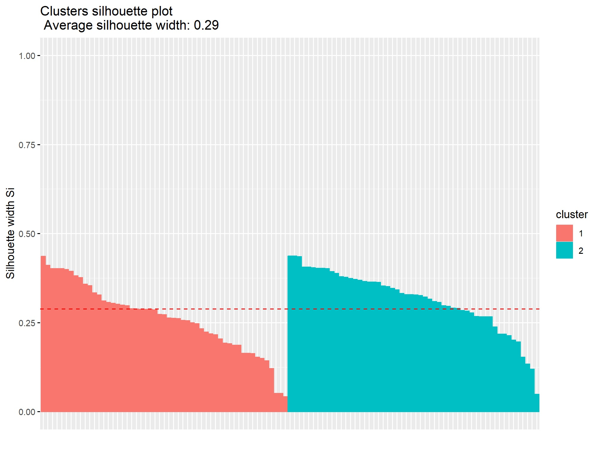
   

   

     <em>Figura 12: Gráfica de valores silhouette para cada punto y el promedio general</em>
   

   *Clustering - CLP vs SHAM - Días 2 y 4 - TOP 15 picos - Algoritmo: kmeans*
   
   

   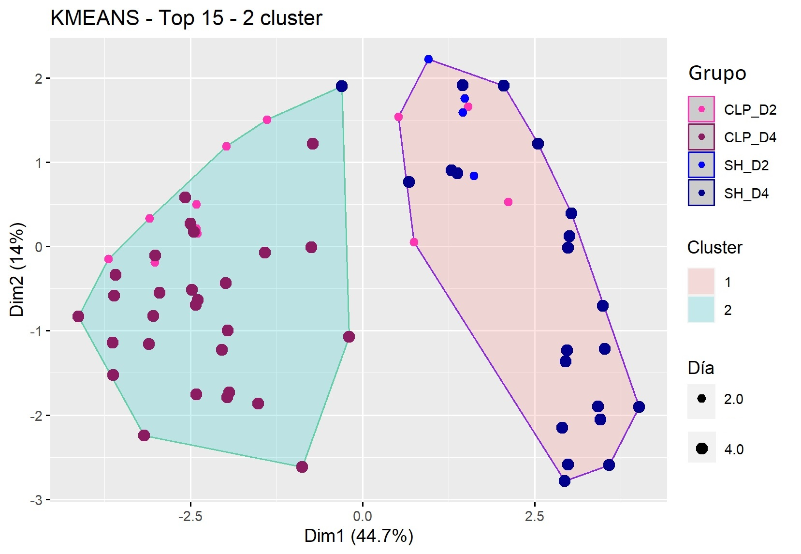
   

   

     <em>Figura 12: Clustering - CLP vs SHAM - Días 2 y 4 - TOP 15 picos - Algoritmo: kmeans</em>
   

   

   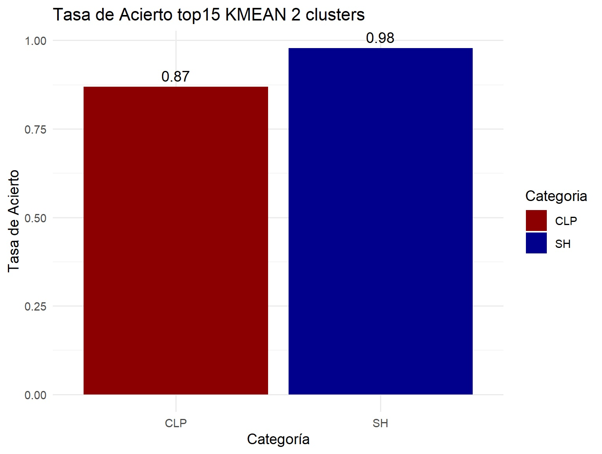
   

   

     <em>Figura 12: Tasa de acierto por día</em>
   

   
   Matriz de confusión y métricas:
   
   | Referencia | cluster1 | cluster2 |
   |------------|----------|----------|
   | SHAM       | 45       | 1        |
   | CLP        | 8        | 53       |

   | Métrica    | Valor |
   |------------|-------|
   | Precision: | 0.98  |
   | Recall:    | 0.87  |
   | F1-Score:  | 0.92  |
   | Accuracy:  | 0.91  |

   | Cluster | Tamaño | Ancho promedio silueta  |
   |---------|--------|-------------------------|
   | 1       | 54     | 0.31                    |
   | 2       | 53     | 0.41                    |

   | Métrica | Valor |
   |---------|-------|
   | VSP     | 0.36  |
   | WCSS    | 210   |
   | BCSS    | 141   |

   

   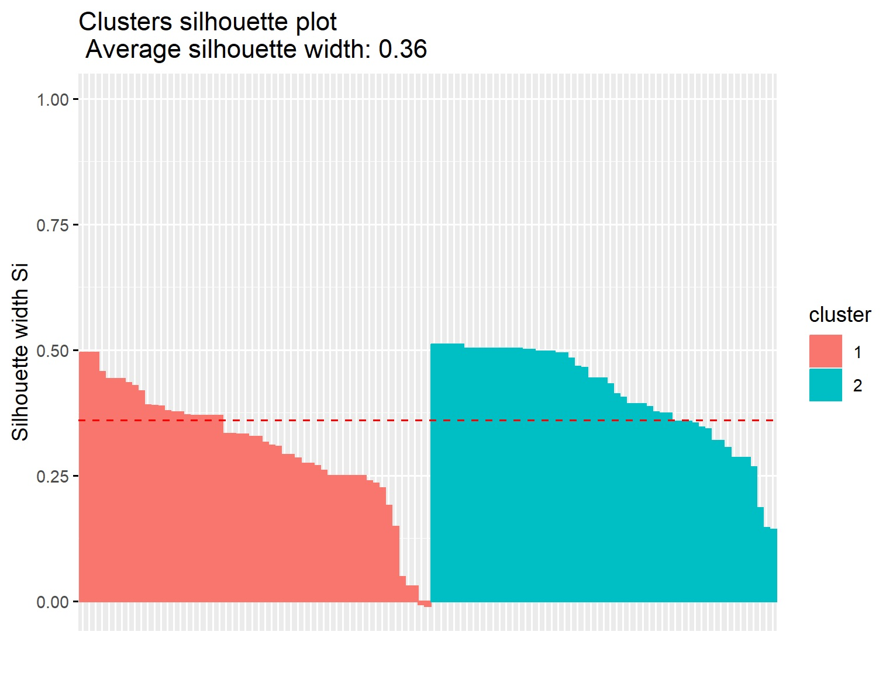
   

   

     <em>Figura 12: Gráfica de valores silhouette para cada punto y el promedio general</em>
   

   *Clustering - CLP vs SHAM - Días 2 y 4 - TOP 10 picos - Algoritmo: kmeans*
   
   

   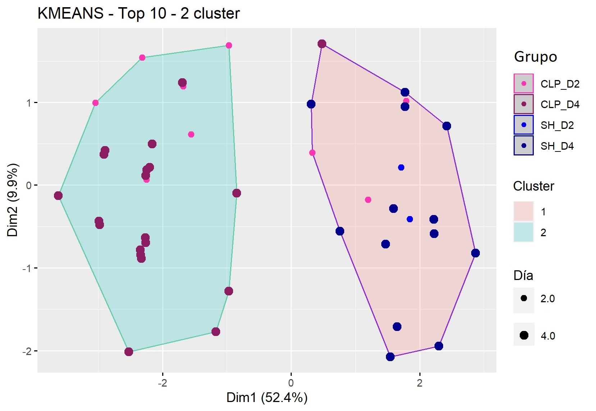
   

   

     <em>Figura 13: Clustering - CLP vs SHAM - Días 2 y 4 - TOP 10 picos - Algoritmo: kmeans</em>
   

   

   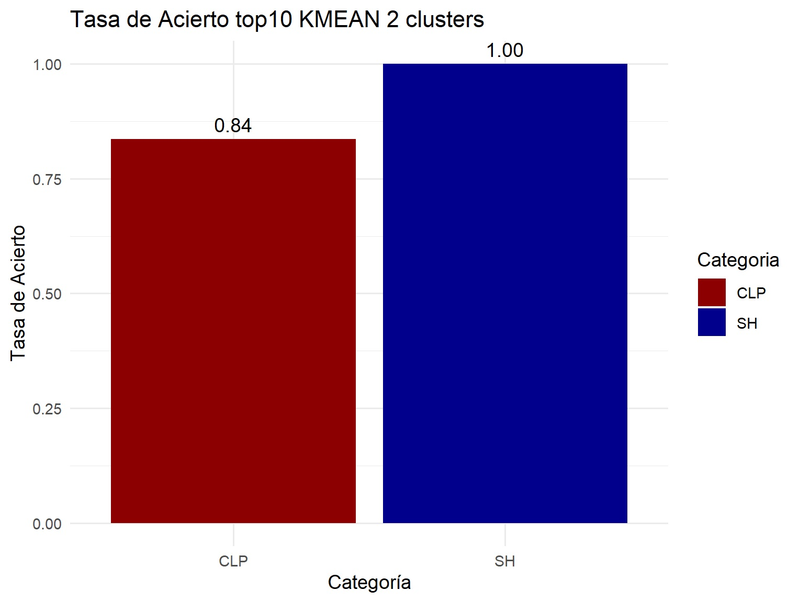
   

   

     <em>Figura 12: Tasa de acierto por día</em>
   

   
   Matriz de confusión y métricas:
   
   | Referencia | cluster1 | cluster2 |
   |------------|----------|----------|
   | SHAM       | 46       | 0        |
   | CLP        | 10        | 51       |

   | Métrica    | Valor |
   |------------|-------|
   | Precision: | 1.00  |
   | Recall:    | 0.84  |
   | F1-Score:  | 0.91  |
   | Accuracy:  | 0.91  |

   | Cluster | Tamaño | Ancho promedio silueta  |
   |---------|--------|-------------------------|
   | 1       | 51     | 0.36                    |
   | 2       | 56     | 0.50                    |

   | Métrica | Valor |
   |---------|-------|
   | VSP     | 0.43  |
   | WCSS    | 128   |
   | BCSS    | 117   |

   

   
   

   

     <em>Figura 12: Gráfica de valores silhouette para cada punto y el promedio    general</em>
   

   *Clustering - CLP vs SHAM - Días 2 y 4 - TOP 20 picos - Algoritmo: PAM*

   

   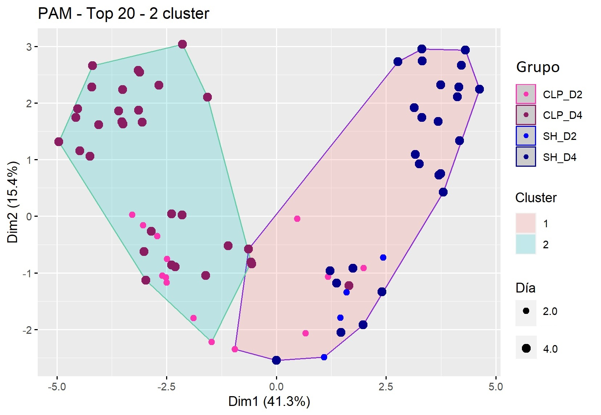
   

   

     <em>Figura 14: Clustering - CLP vs SHAM - Días 2 y 4 - TOP 20 picos - Algoritmo: PAM</em>
   

   

   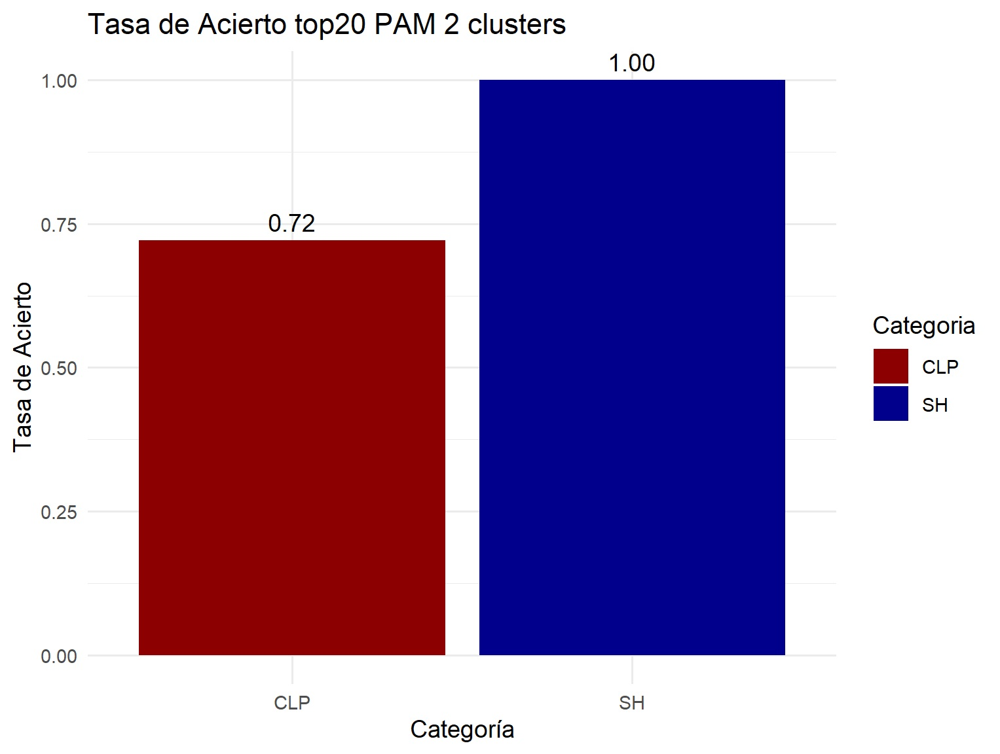
   

   

     <em>Figura 12: Tasa de acierto por día</em>
   

   
   Matriz de confusión y métricas:
   
   | Referencia | cluster1 | cluster2 |
   |------------|----------|----------|
   | SHAM       | 46       | 0        |
   | CLP        | 17       | 44       |

   | Métrica    | Valor |
   |------------|-------|
   | Precision: | 1.00  |
   | Recall:    | 0.72  |
   | F1-Score:  | 0.84  |
   | Accuracy:  | 0.84  |

   | Cluster | Tamaño | Ancho promedio silueta  |
   |---------|--------|-------------------------|
   | 1       | 63     | 0.32                    |
   | 2       | 44     | 0.29                    |

   | Métrica | Valor |
   |---------|-------|
   | VSP     | 0.30  |
   | WCSS    | 432   |
   | BCSS    | 423   |

   

   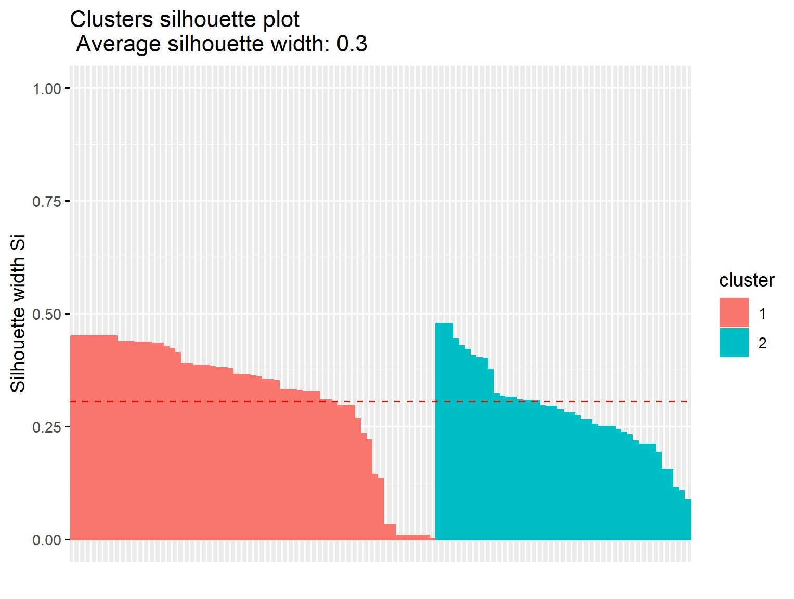
   

   

     <em>Figura 12: Gráfica de valores silhouette para cada punto y el promedio    general</em>
   

   *Clustering - CLP vs SHAM - Días 2 y 4 - 3 clusters - TOP 20 picos - Algoritmo: PAM*

   

   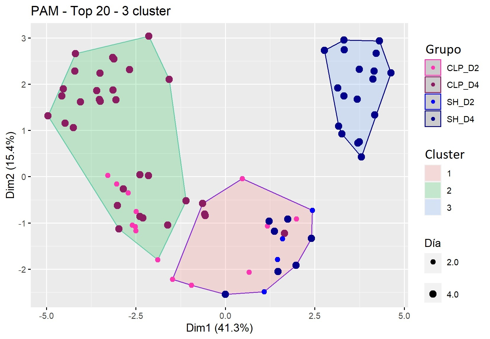
   

   

     <em>Figura 15: Clustering - CLP vs SHAM - Días 2 y 4 - 3 clusters - TOP 20 picos - Algoritmo: PAM</em>
   

   

   
   

   

     <em>Figura 12: Gráfica de valores silhouette para cada punto y el promedio    general</em>
   

   | Cluster | Tamaño | Ancho promedio silueta  |
   |---------|--------|-------------------------|
   | 1       | 42     | 0.24                    |
   | 2       | 42     | 0.24                    |
   | 3       | 23     | 0.39                    |

   *Clustering - CLP vs SHAM - Días 2 y 4 - 3 clusters - TOP 30 picos - Algoritmo: PAM*
   
   

   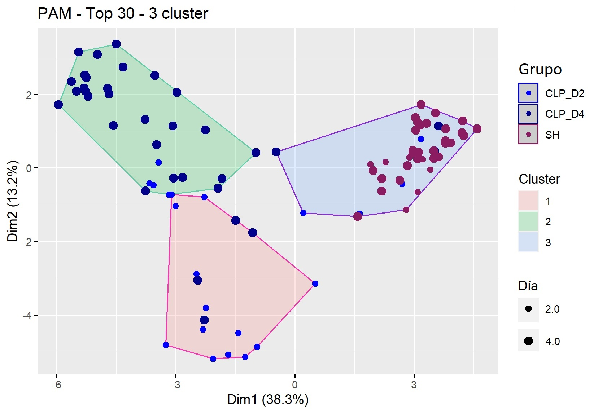
   

   

     <em>Figura 16: Clustering - CLP vs SHAM - Días 2 y 4 - 3 clusters - TOP 30 picos - Algoritmo: PAM</em>
   

   

   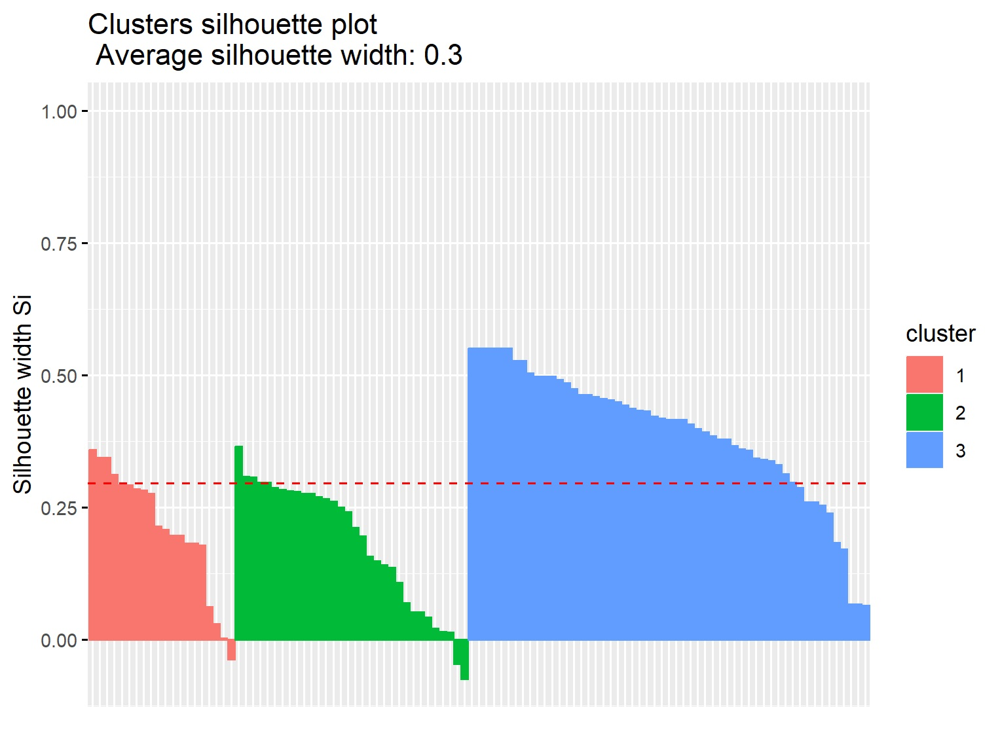
   

   

     <em>Figura 12: Gráfica de valores silhouette para cada punto y el promedio    general</em>
   

   | Cluster | Tamaño | Ancho promedio silueta  |
   |---------|--------|-------------------------|
   | 1       | 20     | 0.21                    |
   | 2       | 32     | 0.18                    |
   | 3       | 55     | 0.39                    |

   *Clustering - CLP vs SHAM - Días 2 y 4 - TOP 10 picos - Algoritmo: PAM*
   
   

   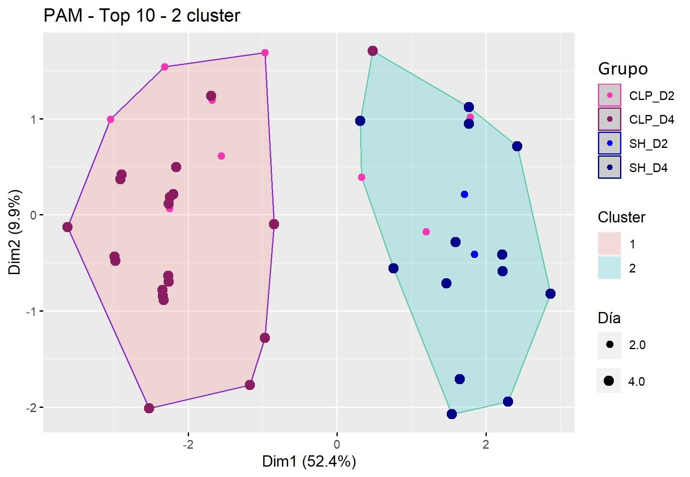
   

   

     <em>Figura 17: Clustering - CLP vs SHAM - Días 2 y 4 - TOP 10 picos - Algoritmo: PAM</em>
   

   

   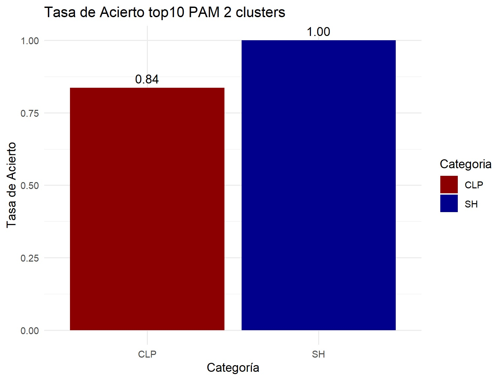
   

   

     <em>Figura 12: Tasa de acierto por día</em>
   

   
   Matriz de confusión y métricas:
   
   | Referencia | cluster1 | cluster2 |
   |------------|----------|----------|
   | SHAM       | 46       | 0        |
   | CLP        | 10       | 51       |

   | Métrica    | Valor |
   |------------|-------|
   | Precision: | 1.00  |
   | Recall:    | 0.84  |
   | F1-Score:  | 0.91  |
   | Accuracy:  | 0.91  |

   | Cluster | Tamaño | Ancho promedio silueta  |
   |---------|--------|-------------------------|
   | 1       | 51     | 0.36                    |
   | 2       | 56     | 0.50                    |

   | Métrica | Valor |
   |---------|-------|
   | VSP     | 0.43  |
   | WCSS    | 177   |
   | BCSS    | 260   |

   

   
   

   

     <em>Figura 12: Gráfica de valores silhouette para cada punto y el promedio    general</em>
   

   ### Archivo: 5_ns_m51_d24

   

   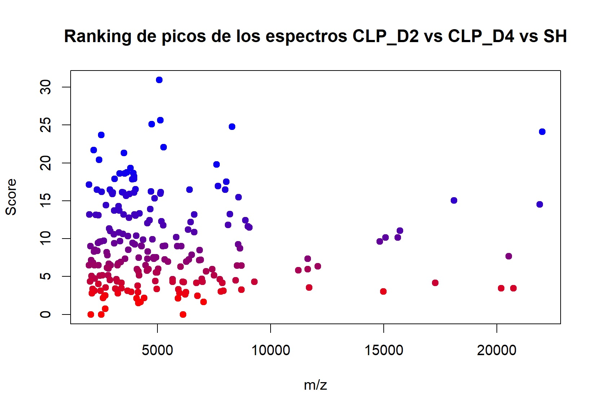
   

   

     <em>Figura 18:  Picos mas preponderantes seleccionados por el algoritmo bindaranking a partir del factor CLP_D2 vs CLP_D4 vs SHAM</em>
   

   

   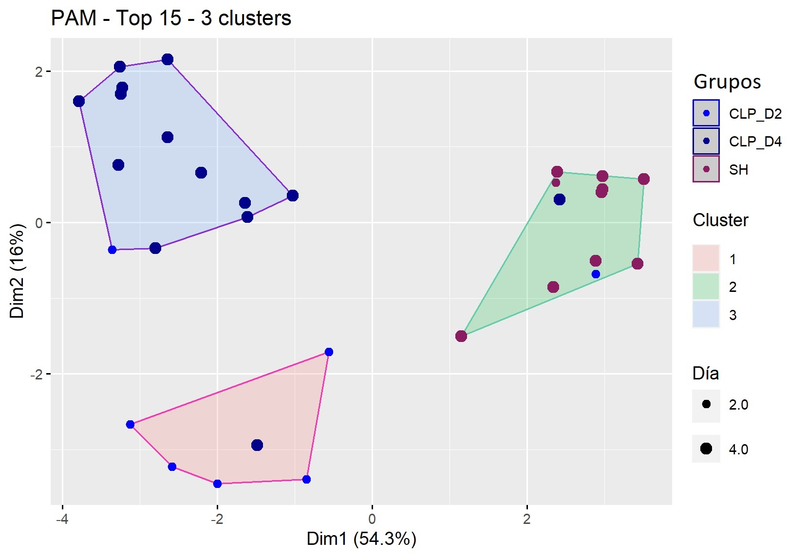
   

   

     <em>Figura 19: Clustering - CLP_D2 vs CLP_D4 vs SHAM - TOP 15 picos - 3 CLUSTERS - Algoritmo: PAM</em>
   

   
   
   ### Archivo: 6_ns_m51_vs_varios

   

   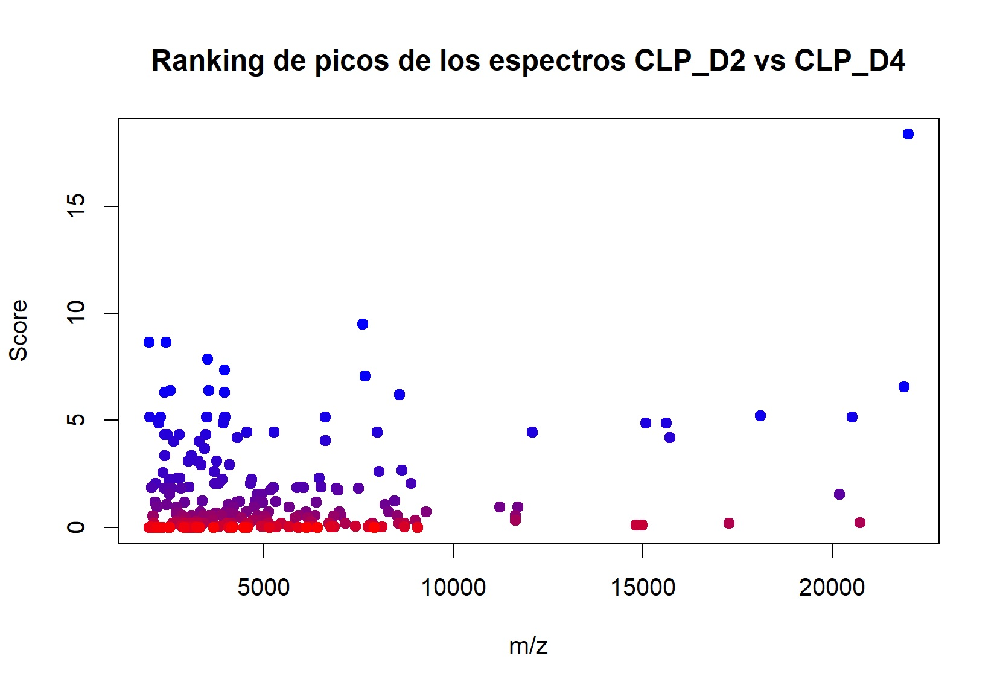
   

   

     <em>Figura 20: Picos mas preponderantes seleccionados por el algoritmo bindaranking a partir del factor CLP_D2 vs CLP_D4</em>
   

   

   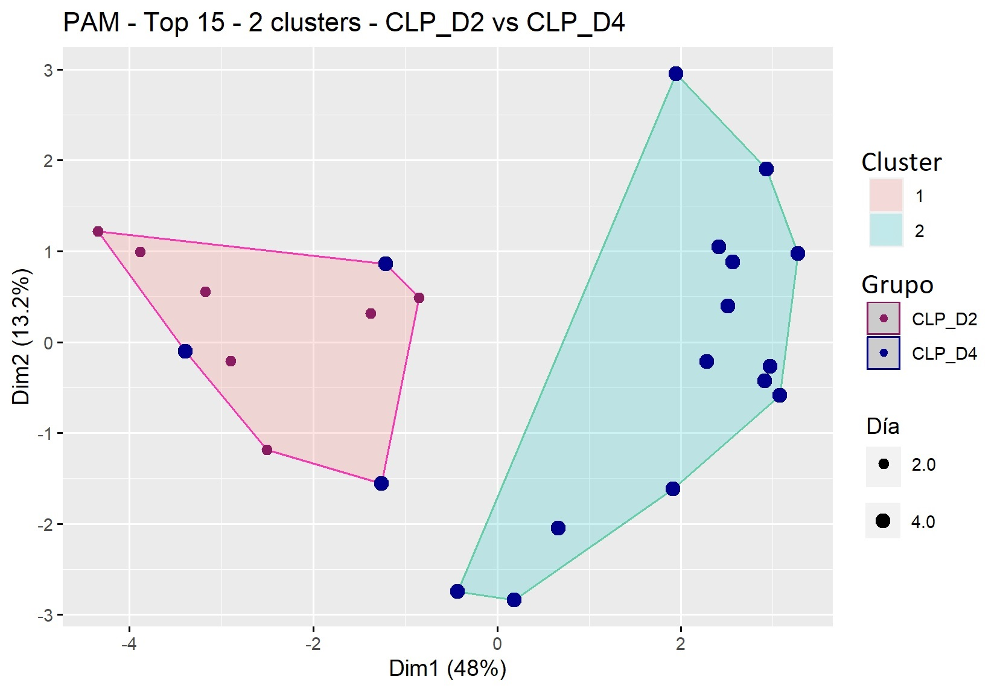
   

   

     <em>Figura 21:  Clustering - CLP_D2 vs CLP_D4 - TOP 15 picos - 2 CLUSTERS - Algoritmo: PAM</em>
   

   

   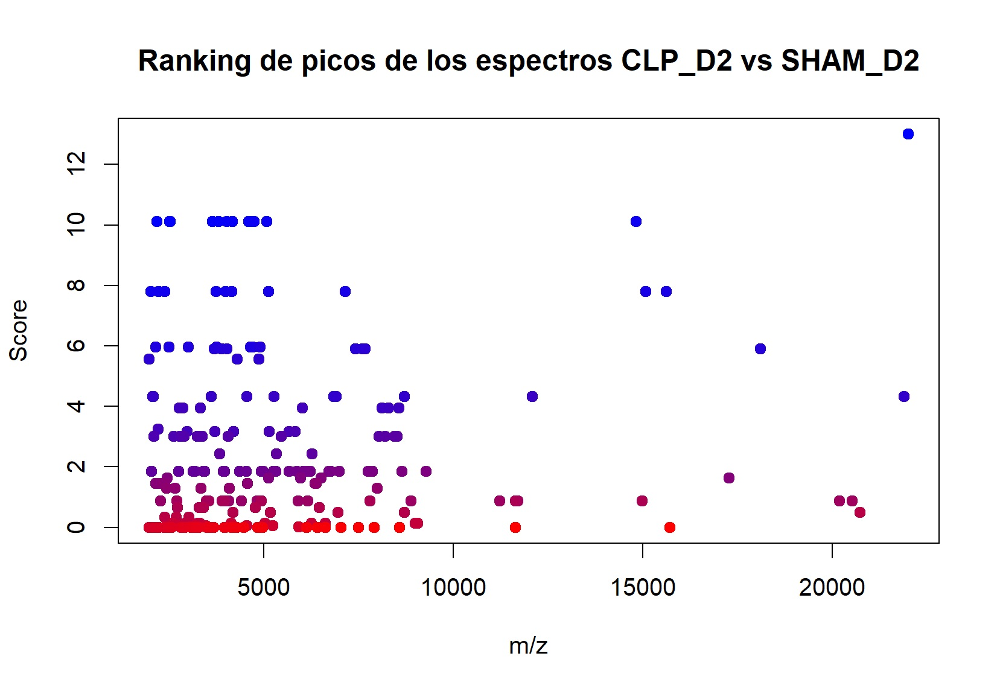
   

   

     <em>Figura 22: Picos mas preponderantes seleccionados por el algoritmo bindaranking a partir del factor CLP_D2 vs SHAM_D2</em>
   

   

   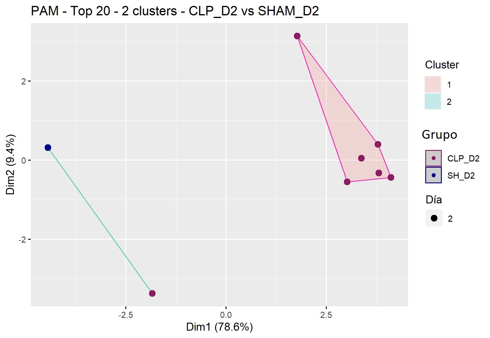
   

   

     <em>Figura 23:  Clustering - CLP_D2 vs SHAM_D2 - TOP 20 picos - 2 CLUSTERS - Algoritmo: PAM</em>
   

   

   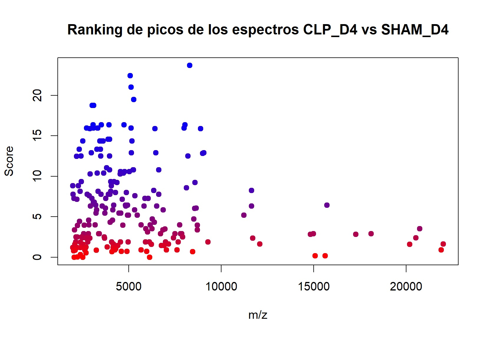
   

   

     <em>Figura 24: Picos mas preponderantes seleccionados por el algoritmo bindaranking a partir del factor CLP_D4 vs SHAM_D4</em>
   

   

   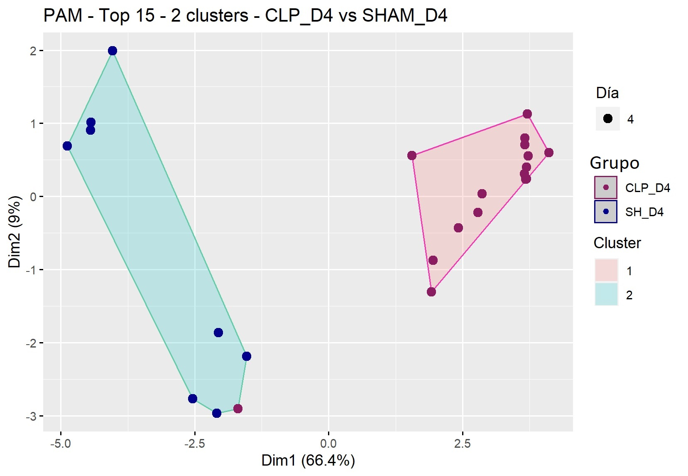
   

   

     <em>Figura 25:  Clustering - CLP_D4 vs SHAM_D4 - TOP 15 picos - 2 CLUSTERS - Algoritmo: PAM</em>
   

## Algoritmos Supervisados

   ### Archivo: 3_s_m122_d1247.R

   Se probaron modelos de aprendizaje supervisado con las 122 réplicas biológicas correspondiente a todos los días.
   
   1) 
Se cargó la matriz dicotómica de 122 réplicas biológicas x 218 picos y se dividieron las muestras en grupo de entrenamiento y grupo de testeo bajo una relación de 60% entrenamiento y 40% testeo.

   2) 
Se seleccionan los 20 picos mas preponderantes mediante el algoritmo *bindaranking* bajo el factor CLP/SHAM con el propósito de reducir la cantidad de predictores.

   3) Se entrenaron los siguientes modelos:
         * Binda (Binary Discriminant Analysis)
         * Random Forest
         * kNN (k nearest neighbor)
         * SVM Radial (Support Vector Machine con kernel radial)
   4) Se realizan las predicciones y a partir de ellas se generan las curvas ROC para cada modelo.

   

   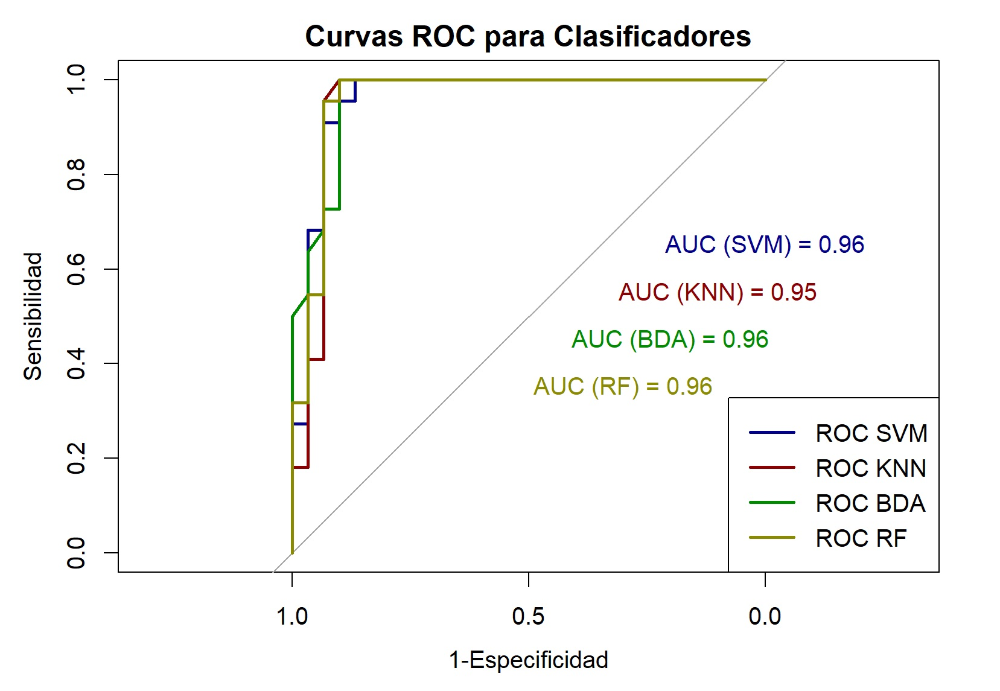
   

   

     <em>Figura 26:  Curvas ROC para cada modelo de entrenamiento y valores de AUC (Área bajo la curva)</em>
   

   ### Archivo: 7_s_m107_d24_top15.ipynb

   Se probaron modelos de aprendizaje supervisado con 107 réplicas biológicas correspondiente a los días 2 y 4.

   1) 
Se representaron los porcentajes de muestras correspondiente a cada tipo de factor (CLP_D2, CLP_D4 y SHAM)

   2) 
Se entrenó un modelo de Regresión Logística

      *Regresión Logística - accuracy score: 86%*

   

   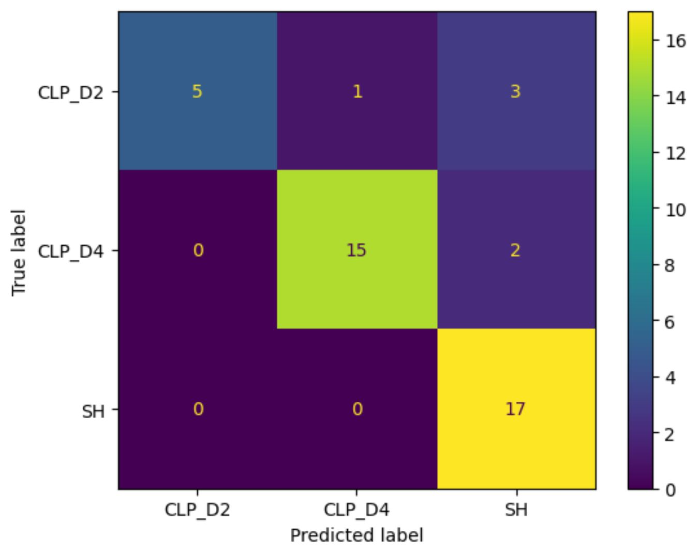
   

   

     <em>Figura 27:  Matriz de confusión de la Regresión Logística</em>
   

   
   3) 
Se entrenó un modelo de Random Forest

      *Random Forest- accuracy score: 72% (A partir de validación cruzada con k=5)*

   

   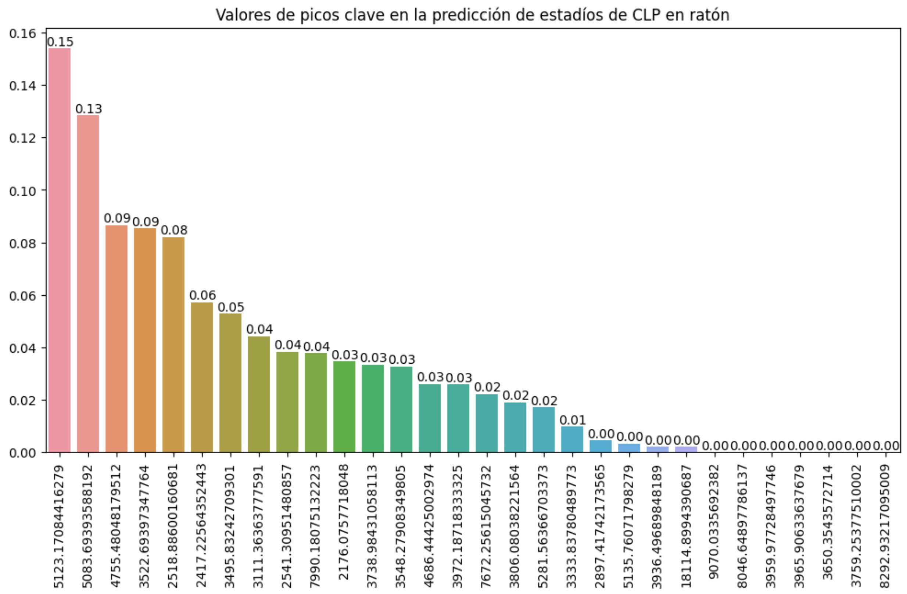
   

   

     <em>Figura 28:  Preponderancia de predictores del Random Forest</em>
   

   

   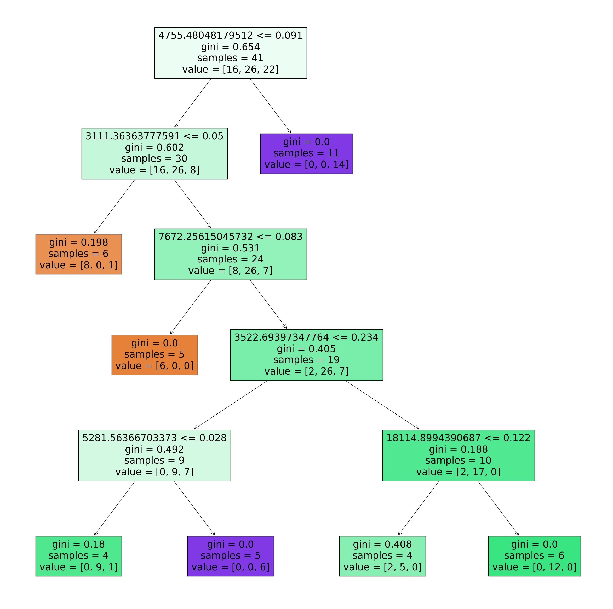
   

   

     <em>Figura 29:  Arbol de decisión del Random Forest</em>
   

## Conclusión
