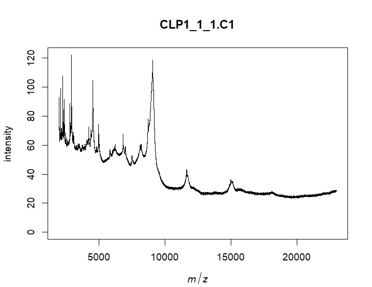

<h1 align="center"> Análisis de muestras de MALDI-TOF de ratones.  </h1>
<h1 align="center"> Para: Lautaro Maceira, Bárbara Rearte  </h1>

   
   

## Índice

*[Descripción del proyecto](#descripción-del-proyecto)

*[Características de las muestras](#características-de-las-muestras)

*[Características y nomenclatura de  los archivos](#nomenclatura-de-los-archivos)

*[Pre-procesamiento](#pre-procesamiento)

*[Algoritmos no supervisados](#algoritmos-no-supervisados)

*[Algoritmos supervisados](#algoritmos-supervisados)

*[Conclusión](#conclusión)

## Descripción del proyecto

El proyecto consiste en el procesamiento y análisis de espectros MALDI-TOF obtenidos a partir de plasma de ratones a los que se le ha realizado una ligadura y punción cecal (CLP) como modelo de sepsis, y ratones impostores (SHAM). El procesamiento consiste en el filtrado, acondicionamiento y transformación de los espectros. El análisis consiste en la utilización de algoritmos de aprendizaje maquinal que permitan detectar características distintivas de estos espectros y clasificar tanto las muestras de CLP como sus diferentes estadíos dentro del modelo de la patología.

## Características de las muestras

* Tipo de muestras: CLP y SHAM
* Días de adquisición: 1, 2, 4 y 7
* Cantidad de muestras iniciales: 303
* Metodología de adquisición: Cada muestra es sub-dividida en "réplicas biológicas" que son depositadas cada una en un pozo o "well" del equipo. Cada una de estas wells puede ser adquirida o leída mas de una vez, obteniéndose así "réplicas técnicas". La cantidad de réplicas biológicas y técnicas por muestra es variable, llegando a un máximo de 3 de cada una. Es decir, en el caso mas extremo, una muestra podría ser replicada tres veces biológicamente, y cada una adquirida otras tres veces, llegando así a un número de nueve adquisiciones correspondientes a una misma muestra.

## Características y nomenclatura de  los archivos

Los lenguajes utilizados para el procesamiento y el análisis de los espectros fueron pyhton y R. Los archivos están enumerados por orden de procesamiento. A excepción del primero

## Pre-procesamiento

## Algoritmos No Supervisados

## Algoritmos Supervisados

## Conclusión
